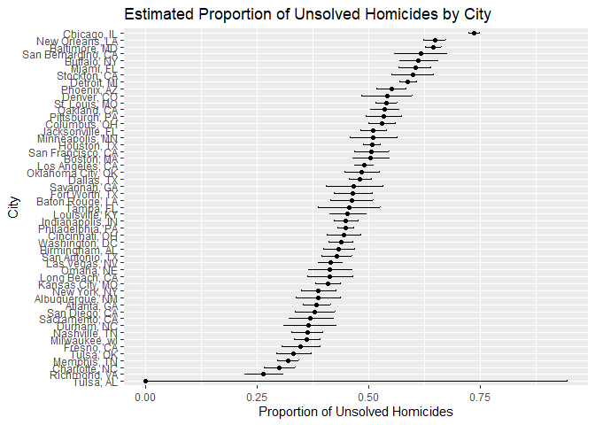
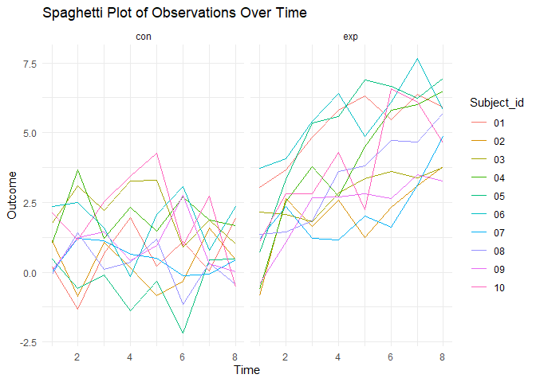
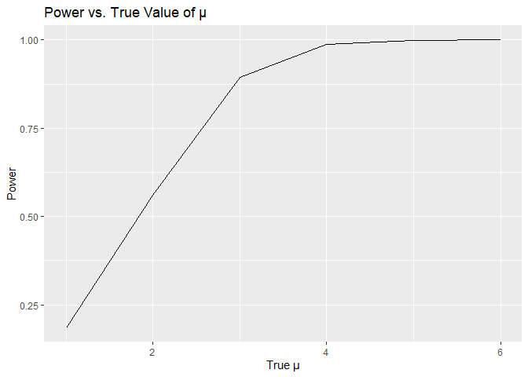

p8105_hw5_rl3401
================
Ruoxi Li
2023-11-14

``` r
library(tidyverse)
```

    ## ── Attaching core tidyverse packages ──────────────────────── tidyverse 2.0.0 ──
    ## ✔ dplyr     1.1.3     ✔ readr     2.1.4
    ## ✔ forcats   1.0.0     ✔ stringr   1.5.0
    ## ✔ ggplot2   3.4.3     ✔ tibble    3.2.1
    ## ✔ lubridate 1.9.2     ✔ tidyr     1.3.0
    ## ✔ purrr     1.0.2     
    ## ── Conflicts ────────────────────────────────────────── tidyverse_conflicts() ──
    ## ✖ dplyr::filter() masks stats::filter()
    ## ✖ dplyr::lag()    masks stats::lag()
    ## ℹ Use the conflicted package (<http://conflicted.r-lib.org/>) to force all conflicts to become errors

``` r
library(broom)
```

## Problem 1

``` r
homicides_df = read_csv("data/homicide-data.csv") 
```

    ## Rows: 52179 Columns: 12
    ## ── Column specification ────────────────────────────────────────────────────────
    ## Delimiter: ","
    ## chr (9): uid, victim_last, victim_first, victim_race, victim_age, victim_sex...
    ## dbl (3): reported_date, lat, lon
    ## 
    ## ℹ Use `spec()` to retrieve the full column specification for this data.
    ## ℹ Specify the column types or set `show_col_types = FALSE` to quiet this message.

``` r
head(homicides_df)
```

    ## # A tibble: 6 × 12
    ##   uid   reported_date victim_last victim_first victim_race victim_age victim_sex
    ##   <chr>         <dbl> <chr>       <chr>        <chr>       <chr>      <chr>     
    ## 1 Alb-…      20100504 GARCIA      JUAN         Hispanic    78         Male      
    ## 2 Alb-…      20100216 MONTOYA     CAMERON      Hispanic    17         Male      
    ## 3 Alb-…      20100601 SATTERFIELD VIVIANA      White       15         Female    
    ## 4 Alb-…      20100101 MENDIOLA    CARLOS       Hispanic    32         Male      
    ## 5 Alb-…      20100102 MULA        VIVIAN       White       72         Female    
    ## 6 Alb-…      20100126 BOOK        GERALDINE    White       91         Female    
    ## # ℹ 5 more variables: city <chr>, state <chr>, lat <dbl>, lon <dbl>,
    ## #   disposition <chr>

The raw data has 52179 observations and 12 variables.

``` r
homicide_summary=
  homicides_df |> 
  mutate(city_state = paste(city, state, sep = ", ")) |> 
  group_by(city_state) |> 
  summarize(
    total_homicides = n(),
    unsolved_homicides = sum(disposition %in% c("Closed without arrest", "Open/No arrest"))
  )

homicide_summary|>
  knitr::kable()
```

| city_state         | total_homicides | unsolved_homicides |
|:-------------------|----------------:|-------------------:|
| Albuquerque, NM    |             378 |                146 |
| Atlanta, GA        |             973 |                373 |
| Baltimore, MD      |            2827 |               1825 |
| Baton Rouge, LA    |             424 |                196 |
| Birmingham, AL     |             800 |                347 |
| Boston, MA         |             614 |                310 |
| Buffalo, NY        |             521 |                319 |
| Charlotte, NC      |             687 |                206 |
| Chicago, IL        |            5535 |               4073 |
| Cincinnati, OH     |             694 |                309 |
| Columbus, OH       |            1084 |                575 |
| Dallas, TX         |            1567 |                754 |
| Denver, CO         |             312 |                169 |
| Detroit, MI        |            2519 |               1482 |
| Durham, NC         |             276 |                101 |
| Fort Worth, TX     |             549 |                255 |
| Fresno, CA         |             487 |                169 |
| Houston, TX        |            2942 |               1493 |
| Indianapolis, IN   |            1322 |                594 |
| Jacksonville, FL   |            1168 |                597 |
| Kansas City, MO    |            1190 |                486 |
| Las Vegas, NV      |            1381 |                572 |
| Long Beach, CA     |             378 |                156 |
| Los Angeles, CA    |            2257 |               1106 |
| Louisville, KY     |             576 |                261 |
| Memphis, TN        |            1514 |                483 |
| Miami, FL          |             744 |                450 |
| Milwaukee, wI      |            1115 |                403 |
| Minneapolis, MN    |             366 |                187 |
| Nashville, TN      |             767 |                278 |
| New Orleans, LA    |            1434 |                930 |
| New York, NY       |             627 |                243 |
| Oakland, CA        |             947 |                508 |
| Oklahoma City, OK  |             672 |                326 |
| Omaha, NE          |             409 |                169 |
| Philadelphia, PA   |            3037 |               1360 |
| Phoenix, AZ        |             914 |                504 |
| Pittsburgh, PA     |             631 |                337 |
| Richmond, VA       |             429 |                113 |
| Sacramento, CA     |             376 |                139 |
| San Antonio, TX    |             833 |                357 |
| San Bernardino, CA |             275 |                170 |
| San Diego, CA      |             461 |                175 |
| San Francisco, CA  |             663 |                336 |
| Savannah, GA       |             246 |                115 |
| St. Louis, MO      |            1677 |                905 |
| Stockton, CA       |             444 |                266 |
| Tampa, FL          |             208 |                 95 |
| Tulsa, AL          |               1 |                  0 |
| Tulsa, OK          |             583 |                193 |
| Washington, DC     |            1345 |                589 |

For the city of Baltimore, MD, use the prop.test function to estimate
the proportion of homicides that are unsolved:

``` r
baltimore_df =
  homicide_summary|>
  filter(city_state == "Baltimore, MD")

baltimore_prop_test =
  prop.test(baltimore_df$unsolved_homicides,baltimore_df$total_homicides)


baltimore_prop_test |>
  broom::tidy()|>
  select(estimate, conf.low, conf.high)|>
  knitr::kable()
```

|  estimate |  conf.low | conf.high |
|----------:|----------:|----------:|
| 0.6455607 | 0.6275625 | 0.6631599 |

The estimated proportion is 0.646. The 95% confidence interval is (
0.628 , 0.663 )

``` r
library(tidyverse)
perform_prop_test <- function(unsolved, total) {
  prop_test_result <- prop.test(unsolved, total)
  tidy_result <- broom::tidy(prop_test_result)
  return(tidy_result)
}


all_cities_prop_test = homicide_summary |>
  mutate(prop_test_results = map2(unsolved_homicides, total_homicides, ~perform_prop_test(.x, .y))) |>
  unnest(prop_test_results) |>
  select(city_state, estimate, conf.low, conf.high)
```

    ## Warning: There was 1 warning in `mutate()`.
    ## ℹ In argument: `prop_test_results = map2(...)`.
    ## Caused by warning in `prop.test()`:
    ## ! Chi-squared近似算法有可能不准

``` r
all_cities_prop_test|>
   knitr::kable()
```

| city_state         |  estimate |  conf.low | conf.high |
|:-------------------|----------:|----------:|----------:|
| Albuquerque, NM    | 0.3862434 | 0.3372604 | 0.4375766 |
| Atlanta, GA        | 0.3833505 | 0.3528119 | 0.4148219 |
| Baltimore, MD      | 0.6455607 | 0.6275625 | 0.6631599 |
| Baton Rouge, LA    | 0.4622642 | 0.4141987 | 0.5110240 |
| Birmingham, AL     | 0.4337500 | 0.3991889 | 0.4689557 |
| Boston, MA         | 0.5048860 | 0.4646219 | 0.5450881 |
| Buffalo, NY        | 0.6122841 | 0.5687990 | 0.6540879 |
| Charlotte, NC      | 0.2998544 | 0.2660820 | 0.3358999 |
| Chicago, IL        | 0.7358627 | 0.7239959 | 0.7473998 |
| Cincinnati, OH     | 0.4452450 | 0.4079606 | 0.4831439 |
| Columbus, OH       | 0.5304428 | 0.5002167 | 0.5604506 |
| Dallas, TX         | 0.4811742 | 0.4561942 | 0.5062475 |
| Denver, CO         | 0.5416667 | 0.4846098 | 0.5976807 |
| Detroit, MI        | 0.5883287 | 0.5687903 | 0.6075953 |
| Durham, NC         | 0.3659420 | 0.3095874 | 0.4260936 |
| Fort Worth, TX     | 0.4644809 | 0.4222542 | 0.5072119 |
| Fresno, CA         | 0.3470226 | 0.3051013 | 0.3913963 |
| Houston, TX        | 0.5074779 | 0.4892447 | 0.5256914 |
| Indianapolis, IN   | 0.4493192 | 0.4223156 | 0.4766207 |
| Jacksonville, FL   | 0.5111301 | 0.4820460 | 0.5401402 |
| Kansas City, MO    | 0.4084034 | 0.3803996 | 0.4370054 |
| Las Vegas, NV      | 0.4141926 | 0.3881284 | 0.4407395 |
| Long Beach, CA     | 0.4126984 | 0.3629026 | 0.4642973 |
| Los Angeles, CA    | 0.4900310 | 0.4692208 | 0.5108754 |
| Louisville, KY     | 0.4531250 | 0.4120609 | 0.4948235 |
| Memphis, TN        | 0.3190225 | 0.2957047 | 0.3432691 |
| Miami, FL          | 0.6048387 | 0.5685783 | 0.6400015 |
| Milwaukee, wI      | 0.3614350 | 0.3333172 | 0.3905194 |
| Minneapolis, MN    | 0.5109290 | 0.4585150 | 0.5631099 |
| Nashville, TN      | 0.3624511 | 0.3285592 | 0.3977401 |
| New Orleans, LA    | 0.6485356 | 0.6231048 | 0.6731615 |
| New York, NY       | 0.3875598 | 0.3494421 | 0.4270755 |
| Oakland, CA        | 0.5364308 | 0.5040588 | 0.5685037 |
| Oklahoma City, OK  | 0.4851190 | 0.4467861 | 0.5236245 |
| Omaha, NE          | 0.4132029 | 0.3653146 | 0.4627477 |
| Philadelphia, PA   | 0.4478103 | 0.4300380 | 0.4657157 |
| Phoenix, AZ        | 0.5514223 | 0.5184825 | 0.5839244 |
| Pittsburgh, PA     | 0.5340729 | 0.4942706 | 0.5734545 |
| Richmond, VA       | 0.2634033 | 0.2228571 | 0.3082658 |
| Sacramento, CA     | 0.3696809 | 0.3211559 | 0.4209131 |
| San Antonio, TX    | 0.4285714 | 0.3947772 | 0.4630331 |
| San Bernardino, CA | 0.6181818 | 0.5576628 | 0.6753422 |
| San Diego, CA      | 0.3796095 | 0.3354259 | 0.4258315 |
| San Francisco, CA  | 0.5067873 | 0.4680516 | 0.5454433 |
| Savannah, GA       | 0.4674797 | 0.4041252 | 0.5318665 |
| St. Louis, MO      | 0.5396541 | 0.5154369 | 0.5636879 |
| Stockton, CA       | 0.5990991 | 0.5517145 | 0.6447418 |
| Tampa, FL          | 0.4567308 | 0.3881009 | 0.5269851 |
| Tulsa, AL          | 0.0000000 | 0.0000000 | 0.9453792 |
| Tulsa, OK          | 0.3310463 | 0.2932349 | 0.3711192 |
| Washington, DC     | 0.4379182 | 0.4112495 | 0.4649455 |

The plot of estimated proportion of unsolved Homicides by City

``` r
ggplot(all_cities_prop_test, aes(x = reorder(city_state, estimate), y = estimate)) +
  geom_point() +
  geom_errorbar(aes(ymin = conf.low, ymax = conf.high), width = 0.2) +
  coord_flip() +
  labs(title = "Estimated Proportion of Unsolved Homicides by City",
       x = "City",
       y = "Proportion of Unsolved Homicides")
```

<!-- -->

## Problem 2

Start with a dataframe containing all file names;iterate over file names
and read in data for each subject and saving the result as a new
variable in the dataframe.

``` r
full_df=
  tibble(path = list.files("data/hw5_data",full.names = TRUE))|>
  mutate(data = map(path, read_csv))
```

Create a tidy dataframe containing data from all participants, including
the subject ID, arm, and observations over time:

``` r
tidy_df = 
  full_df |>
  unnest()|>
  mutate(
    arm = str_sub(path,15, 17),
    subject_id=str_sub(path, 19, 20)) |>
  pivot_longer(
    week_1:week_8,
    names_to = "week",
    values_to = "outcome",
    names_prefix = "week_") |>
  mutate(week = as.numeric(week)) |>
  select(arm, subject_id , week, outcome)
```

    ## Warning: `cols` is now required when using `unnest()`.
    ## ℹ Please use `cols = c(data)`.

The spaghetti plot showing observations on each subject over time

``` r
ggplot(tidy_df, aes(x = week, y = outcome, group = subject_id,color=subject_id))+
  geom_line()+
  labs(title = "Spaghetti Plot of Observations Over Time",
       x = "Time",
       y = "Outcome",
       color = "Subject_id") +
  theme_minimal()+
   facet_grid(~arm) 
```

<!-- -->

Over the 8-week study, participants in the experimental group exhibited
an increasing trend in outcomes, despite some fluctuations. In contrast,
the control group did not show a similar trend, with their outcomes
remaining relatively stable throughout the study period. \## Problem 3

Set parameters:

``` r
set.seed(123)
n <- 30
sigma <- 5
mu_values <- 1:6
alpha <- 0.05
num_simulations <- 5000
```

Create a dataframe to store results, perform t-test

``` r
results = expand_grid(mu = mu_values, sim = 1:num_simulations) |>
  mutate(
    data = map2(mu, sim, ~rnorm(n, .x, sigma)),
    t_test = map(data, ~t.test(.x, mu = 0)),
    tidy_test = map(t_test, tidy),
    mu_hat = map_dbl(tidy_test, ~.x$estimate),
    p_value = map_dbl(tidy_test, ~.x$p.value),
    reject_null = p_value < alpha
  ) |>
  select(mu, mu_hat, p_value, reject_null)
```

Plot showing the power of the test

``` r
results|>
  group_by(mu) |>
  summarize(power = mean(reject_null)) |>
  ggplot(aes(x = mu, y = power)) +
  geom_line() +
  labs(title = "Power vs. True Value of μ", x = "True μ", y = "Power")
```

<!-- -->
Power increases as the effect size increases.

Plot showing the average estimates of mu

``` r
ggplot(results, aes(x = mu, y = mu_hat)) +
  geom_line(stat = "summary", fun = mean, color = "blue", size = 1) +
  geom_point(stat = "summary", fun = mean, color = "blue", size = 2) +
  geom_line(data = subset(results, reject_null), aes(x = mu, y = mu_hat), 
            stat = "summary", fun = mean, color = "red", size = 1) +
  geom_point(data = subset(results, reject_null), aes(x = mu, y = mu_hat), 
             stat = "summary", fun = mean, color = "red", size = 2) +
  ylab("Average Estimate of μ") +
  xlab("True Value of μ") +
  ggtitle("Average Estimates of μ^ vs. True μ") +
  scale_color_identity(guide = 'legend', labels = c("All Tests", "Reject Null")) +
  theme_minimal()
```

    ## Warning: Using `size` aesthetic for lines was deprecated in ggplot2 3.4.0.
    ## ℹ Please use `linewidth` instead.
    ## This warning is displayed once every 8 hours.
    ## Call `lifecycle::last_lifecycle_warnings()` to see where this warning was
    ## generated.

<!-- -->

When the mean is modest, particularly below 4 in this scenario, the
observed discrepancy between the sample average $\hat{\mu}$ in instances
where the null hypothesis is rejected and the true mean becomes evident.
This divergence can be attributed to the relatively minimal effect size
coupled with a correspondingly lower statistical power of the test.
